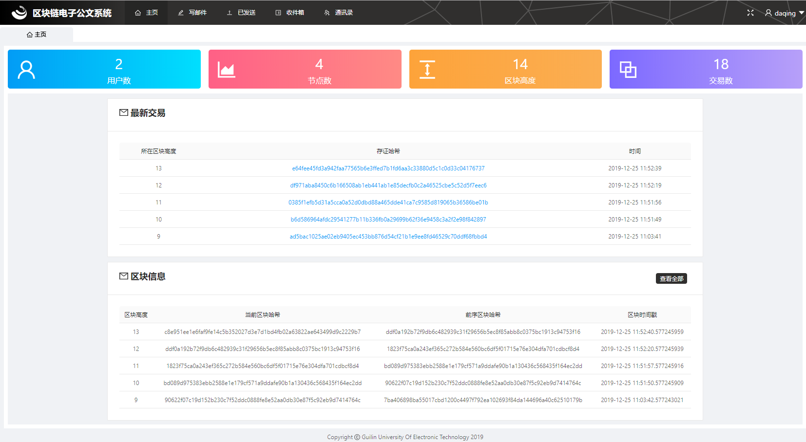
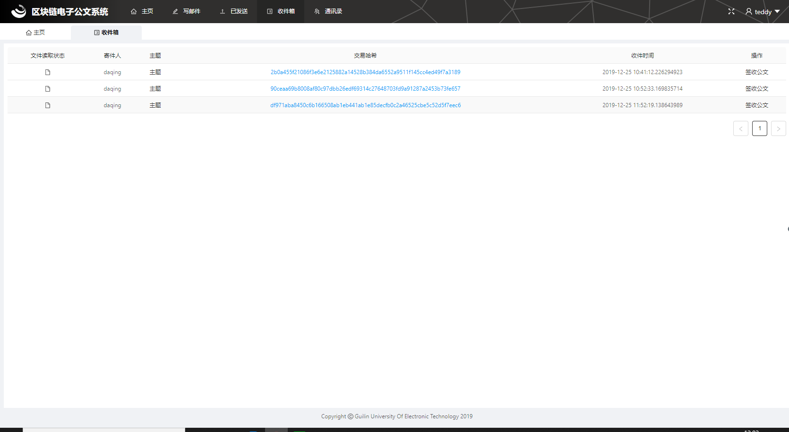

# React Admin
基于[React](https://reactjs.org)、[Ant Design](https://ant.design/)的管理系统架构。

实现集成区块链分布式存储和ipfs寻址查询的电子公文系统

<!-- ## 文档地址
最新文档[在这里](https://open.vbill.cn/react-admin)

## 项目预览
预览地址[在这里](https://open.vbill.cn/react-admin-live/)

注：由于是存静态发布，所有涉及到ajax请求的功能都会报404错误，属于正常现象。 -->

## 项目截图
这里只提供了部分页面截图，根据文档[快速开始](https://open.vbill.cn/react-admin/START.html)进行项目的搭建，浏览项目丰富功能！

<table>
    <tr>
        <td></td>
        <td></td>
    </tr>
    <tr>
        <td></td>
        <td></td>
    </tr>
</table>
